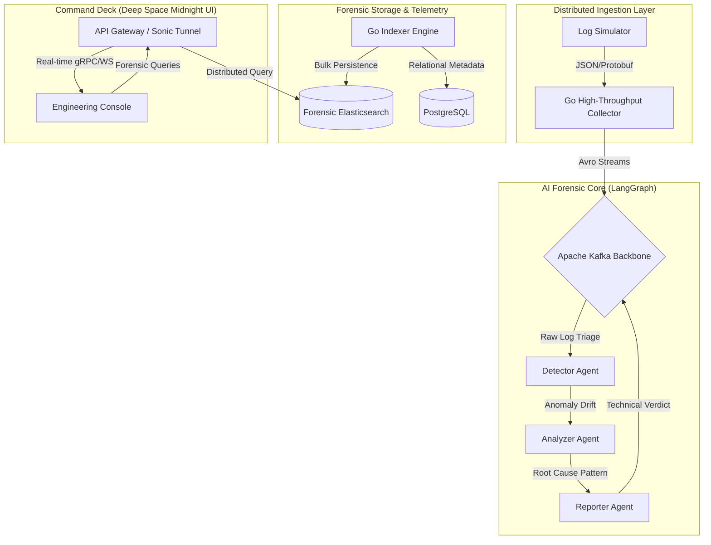

# 🛡️ AI Log Analysis Platform: Forensic Intelligence Engine

An elite, cloud-native developer intelligence platform designed to transform raw distributed telemetry into actionable forensic insights. Built for high-stakes stability, this engine leverages **Multi-Agent LangGraph Orchestration** and **Deep-Space Analytics** to radically reduce MTTR (Mean Time To Recovery).

---

## 🏗️ Technical Architecture: The Forensic Mesh

The platform is architected as a highly-resilient, event-driven mesh. It captures distributed telemetry, processes it through a real-time AI brain, and delivers "Surgical Verdicts" to the engineering command deck.



---

## 🌟 Key Engineering Pillars

### 🧠 Multi-Agent Forensic Brain
- **Orchestrated Analysis**: Uses a specialized 5-agent pipeline (Detector, Pathologist, Predictor, Commander, Alerter) to perform deep "autopsies" on system failures.
- **Root Cause Determination**: Beyond stack traces—automatically identifies complex cascading failures (e.g., *Shard Resource Pressure → Connection Pool Exhaustion → Upstream API Timeout*).
- **Predictive Trajectories**: Forecasts the "blast radius" of current irregularities to prevent SEV-1 outages before they occur.

### 🛰️ Sonic Tunnel Real-Time Streaming
- **Ultra-Low Latency**: End-to-end log propagation using **Apache Kafka** and **WebSockets** for a truly live engineering environment.
- **Surgical Telemetry**: Every log entry is enriched with technical metadata, environment context, and historical parity scores.

### 🎨 Command Deck: Forensic-Grade UI
- **Deep Space Midnight Aesthetic**: High-density engineering console designed for professional focus.
- **Forensic Briefings**: AI-generated incident reports that look like Signal Intelligence (SIGINT) briefings, including risk indices and technical remediation directives.

---

## 🛠️ Performance-Hardened Tech Stack

- **Go (v1.26.1)**: Architected for million-msg/sec ingestion and surgical indexing.
- **Python (v3.11)**: Multi-agent orchestration using **LangGraph** and **Azure OpenAI (GPT-4o)**.
- **Kafka**: The distributed neural backbone for real-time event synchronization.
- **Elasticsearch**: Petabyte-scale forensic storage for archival log analysis.
- **Next.js & Framer Motion**: High-performance, low-latency "Command Center" dashboard.

---

## 🚀 Quick Launch (Forensic Readiness)

### 1. Environment Synchronization
Populate your `.env` with elite credentials:
```env
LLM_PROVIDER=azure
AZURE_OPENAI_API_KEY=your_key
AZURE_OPENAI_ENDPOINT=your_endpoint
AZURE_OPENAI_DEPLOYMENT_ID=gpt-4o-forensic
```

### 2. Ignition Sequence
```bash
make setup # Initialize environments & parity checks
make build # Containerize all microservices
make up    # Launch the Forensic Mesh
```

### 3. Incident Simulation (Demonstration Mode)
Verify the AI's forensic capabilities by injecting a complex failure scenario:
```bash
# Inject an OAuth Token Poisoning cascade
python3 log-simulator/simulator.py --scenario=silent_poison
```

---

## 🛡️ Forensic Output Preview

When the platform detects an irregularity, it doesn't just "log error"—it generates a **Forensic Intelligence Briefing**:

```json
{
  "verdict": "Synchronous Connection Pool Exhaustion",
  "root_cause_analysis": "Shard-3 Disk I/O saturation leading to long-held locks in db-cluster-01",
  "blast_radius": ["auth-service", "inventory-api", "payment-gateway"],
  "technical_directives": [
    "Scale replica set shard-3 to 5 nodes",
    "Flush redis cache for user-session-02",
    "Execute pg_terminate_backend across stale PIDs"
  ]
}
```

**Engineered for High-Stakes Reliability. Powered by AI Forensics.**

---

## 🌐 Cloudflare Deployment Guide (Frontend)
To optimize costs and performance, we recommend deploying the Frontend to **Cloudflare Pages**.

### 1. Connection Steps
1.  Log in to the [Cloudflare Dashboard](https://dash.cloudflare.com/).
2.  Navigate to **Workers & Pages** -> **Create application** -> **Pages** -> **Connect to Git**.
3.  Select your `Real-Time-AI-Log-Analysis-Platform` repository.

### 2. Build Configuration
- **Project Name**: `ai-forensic-dashboard`
- **Framework Preset**: `Next.js`
- **Build Command**: `npm run build`
- **Build Output Directory**: `.next`
- **Root Directory**: `frontend`

### 3. Environment Variables (CRITICAL)
Add these in the Cloudflare Dashboard under **Settings** -> **Environment Variables**:
- `NEXT_PUBLIC_API_URL`: `http://20.200.255.31`
- `NEXT_PUBLIC_WS_URL`: `ws://20.200.255.31/api/v1/ws/stream`

### 4. Custom Domain Setup
To use your own domain (e.g., `dashboard.yourdomain.com`):
1.  In Cloudflare Pages, go to **Custom Domains** -> **Set up a custom domain**.
2.  Enter your domain name.
3.  Cloudflare will automatically provide the **CNAME** records.
4.  Update your DNS provider (e.g., GoDaddy, Namecheap) with these CNAME records pointing to your `*.pages.dev` URL.

---
