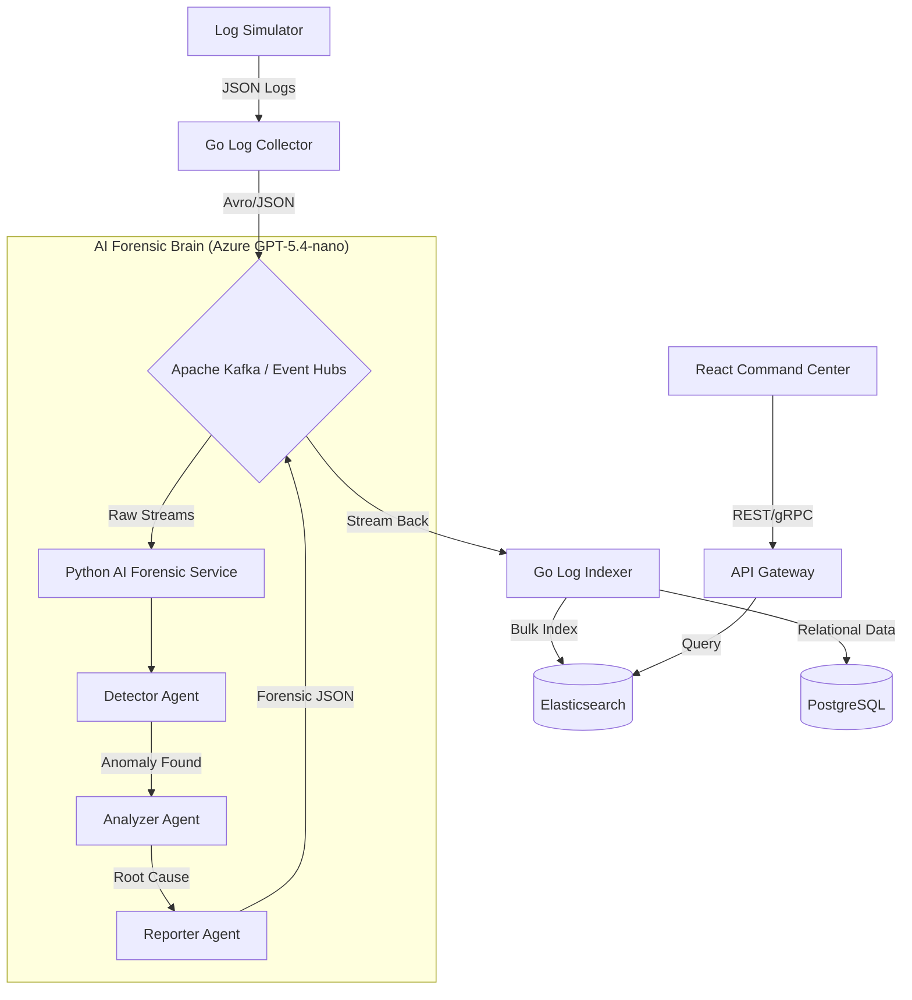

# 🛡️ AI Log Analyzer: Enterprise Forensic Platform

An advanced, cloud-native log analysis platform that leverages **Azure GPT-5.4-nano** and a multi-agent **LangGraph** orchestration to perform real-time root cause analysis (RCA) on multi-service failures.

---

## 🏗️ System Architecture



---

## 🌟 Key Cloud-Native Features

### 🧠 Azure GPT-5.4-nano Forensics
- **Multi-Agent Orchestration**: Uses a 5-agent pipeline (Detector, Analyzer, Predictor, Reporter, Alerter) to investigate system failures.
- **Token-Saving Prompts**: Surgically-compressed system prompts designed for the **Azure Student Free Trial** to maximize quota efficiency.
- **Root Cause Determination**: Automatically identifies complex cascading failures (e.g., Shard failure -> Pool exhaustion -> Timeout).

### 🛡️ Cloud-Hardening
- **Azure Event Hubs Ready**: Kafka connector is hardened with **SASL/SSL** and custom dialers for secure cloud production.
- **Microservice Resiliency**: Fully containerized Go and Python services with health-checks and automated recovery.
- **Token Intelligence**: Built-in "Normalization Layer" to translate ultra-cheap AI keys back into rich platform entities.

---

## 🛠️ Tech Stack

- **Go (v1.26.1)**: High-performance ingestion (Log Collector) and indexing (Log Indexer).
- **Python (v3.11)**: Multi-agent AI orchestration using **LangGraph** and **Azure OpenAI**.
- **Kafka**: Real-time distributed data backbone.
- **Elasticsearch**: Petabyte-scale forensic storage.
- **Docker**: Containerized orchestration for seamless deployment.

---

## 🚀 Quick Start (Gold-Vetted Sequence)

### 1. Environment Unlock
Ensure your `.env` contains your **Azure OpenAI** credentials:
```env
LLM_PROVIDER=azure
AZURE_OPENAI_API_KEY=your_key
AZURE_OPENAI_ENDPOINT=your_endpoint
AZURE_OPENAI_DEPLOYMENT_ID=gpt-5.4-nano
```

### 2. Ignite the Platform
```bash
make setup # Sync environments
make build # Build all microservices
make up    # Launch the entire stack
```

### 3. Run the "Master Diagnostic"
Verify the full pipeline—from Log Ingestion to Azure GPT Analysis—with one command:
```bash
make test-full
```
*This command injects a Fatal log, waits 30s for the AI to "finish the autopsy," and proves success by querying Elasticsearch.*

---

## 📊 Monitoring & Forensics
- **Logs**: `docker compose logs -f`
- **AI Health**: Check `http://localhost:8000/health`
- **Collector Metrics**: `http://localhost:8081/metrics`
- **Elasticsearch Stats**: `curl -s http://localhost:9200/_cat/indices?v`

---

## 🛡️ Forensic Output Preview
When an incident occurs, the platform generates a report like this:
```json
{
  "title": "Incident: db-cluster Connection Pool Exhaustion",
  "severity": "SEV-1",
  "root_cause": "Shard-1 resource pressure (CPU ~85%) causing upstream timeout",
  "recovery_plan": ["Restart Shard-1", "Tune pool sizing", "Enable circuit breakers"]
}
```

**Built for high-stakes infrastructure stability. Powered by Azure AI.**
